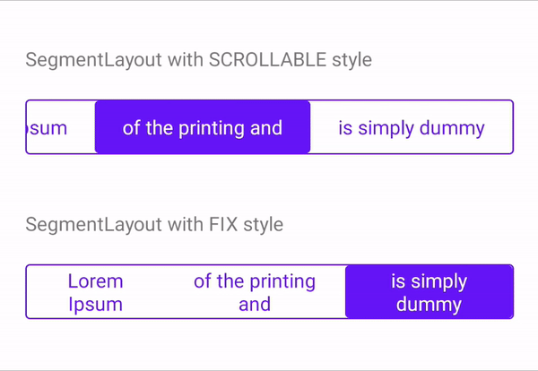

# Android SegmentView
Simple SegmentView for Android with easily usage.



## Usage
### Easily using in xml layout.
```xml
<org.cuongnv.segmentview.SegmentLayout
    android:layout_width="match_parent"
    android:layout_height="40dp"
    android:layout_marginTop="20dp"
    android:background="@drawable/bg_segment_background"
    android:padding="@dimen/segment_stroke_width"
    app:layout_constraintTop_toTopOf="parent"
    app:sgm_isFixSize="false"
    app:sgm_selectedDrawable="@drawable/bg_segment_selected">

    <TextView
        style="@style/SimpleTextView"
        android:layout_width="wrap_content"
        android:layout_height="match_parent"
        android:text="@string/text1" />

    <TextView
        style="@style/SimpleTextView"
        android:layout_width="wrap_content"
        android:layout_height="match_parent"
        android:text="@string/text2" />
</org.cuongnv.segmentview.SegmentLayout>
```

### Define via code.
```kotlin
val options = arrayOf(R.string.text1, R.string.text2, R.string.text3)

// Build SegmentView programmatically.
findViewById<SegmentLayout>(R.id.segment_view).apply {
    reset()
    options.forEach { resId ->
        addView(
            TextView(this@MainActivity).apply {
                TextViewCompat.setTextAppearance(this, R.style.SimpleTextView)
                setText(resId)
            },
            ViewGroup.MarginLayoutParams(
                ViewGroup.MarginLayoutParams.WRAP_CONTENT,
                ViewGroup.MarginLayoutParams.MATCH_PARENT
            )
        )
    }
}
```

### Customize:
By changing drawable of `android:background`, `sgm_selectedDrawable` and style of child view.
